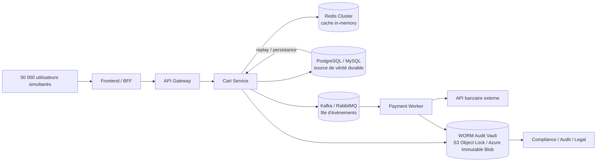

# Architecture technique proposée pour MegaShop-B2B

## 1) Contrainte : panier ultra-rapide et résilient

### Pattern / technologie retenue

- Cache in-memory Redis cluster en front du système de persistance.
- Le panier est lu en priorité depuis Redis, avec écriture asynchrone vers la base transactionnelle principale.
- La base principale conserve la vérité durable, mais le chemin critique de lecture est isolé du stockage relationnel.

Flux de conception :

```text
Client -> API / BFF -> Cart Service -> Redis (hot path, < 50ms)
                                \-> PostgreSQL (persistance, non critique au temps réel)
                                \-> Redis Stream / Queue (delta replay vers le stockage durable)
```

### Pourquoi ce choix répond à la contrainte

- Redis fournit une latence faible, typiquement sous 10-20 ms en mémoire, compatible avec le besoin de < 50 ms.
- La base principale devient un composant de persistance plutôt qu'un point de latence critique pour chaque lecture de panier.
- En cas d'indisponibilité de la base, le panier reste exploitable via le cache, ce qui évite une panne fonctionnelle complète du canal achat.

### Cohérence : évolutive ou forte ?

- On choisit une cohérence éventuelle, pas forte, sur le point de vente du panier.
- L'impact business est clair : un client peut voir un état légèrement obsolète quelques secondes, mais il garde un accès continu au panier.
- Le risque réel de perte de panier est bien moindre que le risque de latence saturante ou de blocage du parcours d'achat.
- La vérité durable reste la base de données ; les différences sont corrigées par une relecture/replication des deltas depuis Redis vers la base.

### Compromis accepté

- Coût : plus de complexité opérationnelle (cache, réplication, délais de convergence).
- Conséquence : en cas de coupure du cache, le système peut afficher un panier partiellement ancien ou refuser des mises à jour lourdes tant que le cache est rétabli.
- Avantage : performance prédictive et disponibilité fonctionnelle en période de dégradation.

### Comportement en cas de panne du composant lui-même

- Si Redis est indisponible :
  - le service passe en mode dégradé ;
  - les opérations d'ajout/suppression de panier sont refusées ou mises en file d'attente si la session existe encore ;
  - le client continue à consulter le dernier panier connu depuis le navigateur ou un cache local de session ;
  - les changements en cours sont journalisés dans une queue de reprise pour être réinjectés dès que Redis revient.
- Si Redis est perdu sans redondance, il y a un risque de régression locale sur les dernières modifications non persistées. C'est un compromis explicite : on sacrifie un peu de cohérence immédiate pour conserver la disponibilité functionnelle du panier.

### Recommandation de mise en œuvre

- Redis Cluster + réplication multi-AZ.
- TTL courte sur les éléments du panier, mais avec écriture durable dans la base via un mécanisme de replay des événements de panier.
- Une table de journaux de changements côté applicatif permet de reconstruire le panier si nécessaire.
- Le service de panier ne doit pas dépendre de la base principale pour des lectures critiques.

---

## 2) Contrainte : logs d'audit inaltérables

### Pattern / technologie retenue

- Un journal d'audit append-only distinct de la base applicative, stocké dans un système WORM (Write Once Read Many), par exemple S3 Object Lock, Azure Immutable Blob, ou un équivalent de vault d'audit.
- Chaque action est transformée en événement immuable, hashé, et signé.

Flux de conception :

```text
App / Service métier -> Event Outbox -> Audit Stream -> WORM Storage
                                              \-> Hash chain / signature / index
Compliance / Legal -> Lecture seule sur le vault d'audit
```

### Pourquoi une table SQL avec triggers ne suffit pas

- Une table SQL n'est pas juridiquement inaltérable parce qu'elle partage le même trust domain que la base applicative.
- Un administrateur DB, un opérateur, ou une personne avec droits de modification peut corriger, supprimer ou réécrire les lignes.
- Les triggers ne garantissent pas l'absence de falsification dans le contexte d'un audit légal : on ne peut prouver que l'historique n'a pas été modifié si le système source et le support d'audit sont sur le même système de confiance.
- L'exigence légale demande une séparation des responsabilités : le journal d'audit doit être hors du périmètre d'édition de l'application.

### Mécanisme concret

- Chaque action (ajout d'article, suppression, validation de commande, paiement, annulation, etc.) produit un événement JSON immuable.
- Les champs clés sont :
  - event_id
  - timestamp_utc
  - actor_id / user_id / service_id
  - action
  - entity_id
  - before_hash / after_hash
  - payload chiffré ou minimisé selon le besoin légal
- Le système calcule un hash chain : `hash(previous_event) + current_payload` pour rendre le flux non réécrivable sans détection.
- Les événements sont écrits en append-only dans le stockage WORM.
- Les données de base applicative restent séparées et ne servent pas de support de preuve juridique.

### Rétention et accès

- Rétention : minimum conforme au besoin légal de l'entreprise (ex. 7 ans, ou plus selon la réglementation locale).
- Accès :
  - écriture uniquement par des services d'ingestion dédiés ;
  - lecture par des comptes de conformité, audit, ou légal uniquement ;
  - aucun utilisateur applicatif n'a le droit de modifier ou de supprimer un événement d'audit.
- Le vault d'audit est en lecture seule pour la plupart des acteurs, avec une politique de gouvernance stricte.

### Compromis accepté

- Coût : stockage supplémentaire, complexité de sécurisation, procédures de conformité, mécanismes de vérification de chaîne de preuve.
- Gain : preuve légale et résistance à la falsification.
- Inconvénient : la performance d'écriture n'est pas la priorité ; on accepte un peu plus de latence pour éviter toute possibilité de modification rétroactive.

### Cas de panne du composant lui-même

- Si le stockage WORM est temporairement indisponible, l'application n'écrase pas le journal local ; elle met en file les événements d'audit dans un buffer durable côté application/queue.
- Le système peut continuer son activité métier, mais l'audit ne peut être déclaré « terminé » qu'après acceptation dans le WORM.
- S'il manque un événement d'audit, on ne le supprime pas : on marque l'état comme incomplet et on déclenche une alerte de sécurité/compliance.
- La règle de sécurité est stricte : mieux avoir un audit incomplet qu'un historique altéré.

---

## 3) Contrainte : paiement bancaire très lent (API externe ~4 s)

### Pattern / technologie retenue

- Découplage par file de messages et orchestrateur de paiement asynchrone.
- Le service de commande ne bloque pas les clients sur l'appel bancaire.

Flux de conception :

```text
Client -> API -> Order Service -> Outbox / Queue -> Payment Worker -> API bancaire
                                                \-> Order DB (statut pending)
                                                \-> Notification / webhook / status callback
```

### Pourquoi ce choix répond au besoin

- Une API bancaire de 4 s de latence ne doit pas être sur le chemin critique transactionnel du front.
- Le système renvoie immédiatement un statut de commande accepté, puis traite le paiement en arrière-plan.
- L'architecture sépare le parcours client de l'API tierce et permet une meilleure résilience face à la lenteur ou à la disponibilité externe.

### Compromis accepté

- Le client ne reçoit pas la confirmation de paiement en temps réel ; il voit une commande en cours de traitement.
- Cela introduit un léger délai de confirmation, mais évite le blocage de l'expérience utilisateur et protège le système de saturation.
- Le coût opérationnel est l'implémentation d'une idempotence stricte au niveau du paiement et de la gestion des retries.

### Cas de panne du composant lui-même

- Si la file de messages est indisponible, la commande est mise en attente en base avec un statut "pending_submission" ; l'API peut signaler au client que le paiement est en cours.
- Si le worker paiement tombe en panne, les messages restent dans la file ; le paiement est retrié sans perdre l'intégrité du flux.
- Si l'API bancaire est en panne, il faut utiliser une clé d'idempotence par commande pour éviter les doubles paiements en cas de retry.
- L'objectif n'est pas de rendre le paiement instantané ; l'objectif est de rendre l'ensemble du système tolérant à une lenteur externe sans perdre les commandes.

---

## 4) Structure globale de l'infrastructure



### Justification de cette architecture

- Le panier est optimisé pour le temps réel.
- La base transactionnelle reste cohérente et durable.
- Le paiement est décorrélé de la lenteur bancaire.
- L'audit est séparé de la base applicative pour répondre à la contrainte légale d'inaltérabilité.
- Aucune technologie n'a été ajoutée par « norme du marché » ; chaque composant résout une contrainte explicite du brief.

---

## Limites assumées

- Cette architecture ne couvre pas de manière volontaire la multi-région active / active ni la reprise après sinistre cross-cloud.
- Elle ne prévoit pas la mise en place d'un DR parfait pour les centres de données en cas de catastrophe régionale complète.
- Les temps de reprise et les procédures de failover restent manuels ou semi-automatisés, car le brief ne demandait pas de souveraineté globale ni de cible RTO/RPO ultra stricte.
- Elle assume un niveau de sécurité fonctionnelle standard et une gouvernance du stockage WORM correctement configurée, sans viser une architecture de conformité internationale complexe.
